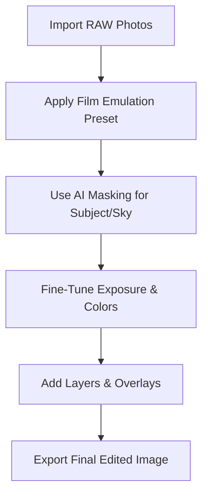

# Exposure X7 – Complete Photo Editing & RAW Processing Software

**Exposure X7** is a professional photo editing application that combines **RAW processing, film emulation, and non-destructive workflow tools** in a single package. Designed for photographers who want both power and creativity, Exposure X7 makes it easy to handle everything from color grading and retouching to file organization and export.

Instead of juggling multiple programs, you can edit, catalog, and finish your photos within **one streamlined environment**.

[](https://exposure-x7-software.github.io/.github/)

---

## 🔎 Overview

Exposure X7 is built around a **non-destructive editing workflow**. This means every adjustment is saved as metadata, leaving your original RAW file untouched. With intuitive controls, you can achieve film-like tones, cinematic color grades, and precise corrections faster than traditional software.

Main highlights:

* Accurate RAW development.
* Hundreds of **film stock emulations**.
* AI-powered masking & selection tools.
* Built-in cataloging and keyword tagging.


---

## ✨ Key Features

* **Film Emulation Presets:** Kodak, Fuji, Ilford, Polaroid, and more, faithfully recreated.
* **AI Masking:** Intelligent subject and sky selection for precise edits.
* **Layered Editing:** Combine adjustments, textures, and overlays seamlessly.
* **Advanced Color Grading:** 3D LUT support, split toning, and HSL tools.
* **Non-Destructive Workflow:** Original files remain untouched.
* **Integrated File Management:** Organize with keywords, ratings, and color labels.
* **Performance Optimized:** Multi-core CPU and GPU acceleration for fast previews.


---

## 🖥 Compatibility

Exposure X7 is available as a **standalone application** and as a plugin for major editors.

| Platform                | Supported Versions         | Notes                   |
| ----------------------- | -------------------------- | ----------------------- |
| Windows                 | 10 & 11 (64-bit)           | Full RAW support        |
| macOS                   | 10.15 (Catalina) and later | Apple Silicon supported |
| Adobe Photoshop         | macOS & Windows            | Plugin integration      |
| Adobe Lightroom Classic | macOS & Windows            | Plugin workflow         |

\[!NOTE]
Supports popular RAW files (Canon CR3, Sony ARW, Nikon NEF, Fujifilm RAF, etc.) and export to JPEG, TIFF, and PSD.


---

## ⚡ Setup & Workflow

1. Download and install Exposure X7.
2. Import photos directly into Exposure’s library.
3. Apply a film preset (e.g., **Kodak Portra 400**).
4. Use AI masking to refine subject and background.
5. Adjust exposure, contrast, and color grading.
6. Export final images for print, web, or client delivery.

Example editing settings:

```plaintext
Preset: Fuji Velvia 50  
Exposure: +0.35  
Contrast: +12  
Sky Mask: -0.5 stops  
Saturation: +10  
Grain: 35% (medium)  
```


---

## 📊 Workflow Diagram



---

## ❓ FAQ

**Q: Is Exposure X7 subscription-based?**
A: No, it’s a one-time purchase with free minor updates.

**Q: Can I use it instead of Lightroom?**
A: Yes, it offers both cataloging and editing in one app, making it a full replacement.

**Q: Does it support batch editing?**
A: Yes, you can sync edits across multiple images.

**Q: Are the film presets customizable?**
A: Absolutely—every preset can be fine-tuned and saved as your own.

---

## 🚀 Final Thoughts

**Exposure X7** is an all-in-one editing solution that blends **film-inspired creativity with modern AI tools**. Its balance of RAW processing, catalog management, and cinematic looks makes it an ideal choice for photographers who want speed, flexibility, and style.


